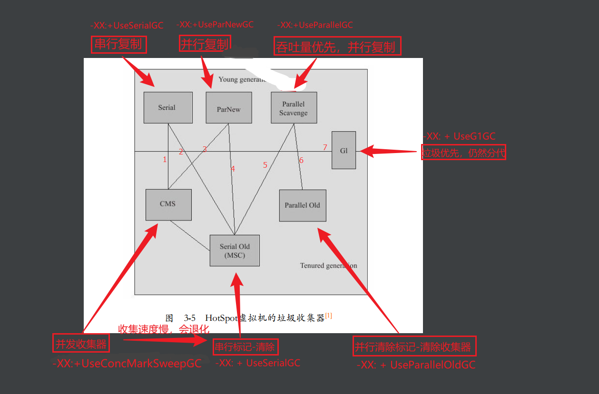

# JVM 调优
!

jdk8

default :
young generation is:PS Scavenge
old generation is:PS MarkSweep

Parallel Scavenge收集器，和Copy收集器类似，不过差别是它采用多线程进行并行收集。Parallel Scavenge收集器的目标则是达到一个可控制的吞吐量（Throughput） 。

Parallel Scavenge收集器提供了两个参数用于精确控制吞吐量， 分别是控制最大垃圾收集停顿时间的-XX：MaxGCPauseMillis参数以及直接设置吞吐量大小的-XX： GCTimeRatio参数。由于与吞吐量关系密切， Parallel Scavenge收集器也经常称为“吞吐量优先” 收集器。 除上述两个参数之外， Parallel Scavenge收集器还有一个参数-XX： +UseAdaptiveSizePolicy值得关注。 这是一个开关参数， 当这个参数打开之后，虚拟机会根据当前系统的运行情况收集性能监控信息， 动态调整这些参数以提供最合适的停顿时间或者最大的吞吐量， 这种调节方式称为GC自适应的调节策略（GC Ergonomics）

jdk8 gc参数
// 设置最大和最小堆内存，线程栈空间
-Xms4G
-Xmx4G
-Xss512K

-XX:+HeapDumpOnOutOfMemoryError
-XX:HeapDumpPath=/export/Logs/ydy-download/java_pid.hprof

-Dpinpoint.applicationName=

