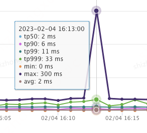
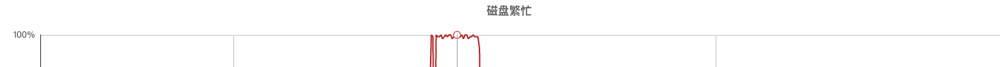
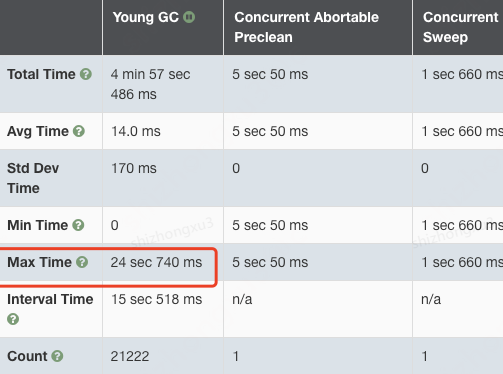
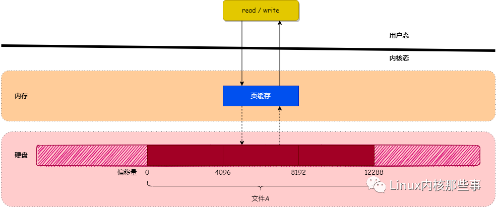

# 磁盘io打满导致的程序性能下降

**2022-2-7 接到反馈，接口性能下降**

## 1.通过查看监控可以发现，接口出现max跳点，但是用户反馈的是20s以上，与图示不符

微服务项目对接口的性能监控不能真实反映接口的请求耗时，还包括rpc框架本身的处理逻辑，
网络传输耗时等。
通过查看容器监控发现，容器的磁盘io繁忙，可能是导致问题的关键。

项目中需要写磁盘的地方就是记录日志，这里包含两部分，程序本身的日志记录，因为
项目启动参数添加了-Xloggc，所以还包含gc日志。程序本身的日志记录开启了异步日志，
所以初步判断是由于gc日志记录被系统调用阻塞，导致的stw时间增加，引发程序阻塞。
通过gceasy打开gc日志文件，开始分析

可以看到yound gc最长执行时间20s+，初步证明了我们的判断。
同时我们发现该容器中部署的应用中其他的接口也出现了同样的问题。

## linux write/read 与 页缓存
（已知：DDR4 内存读写速度是机械硬盘500倍，是固态硬盘的200倍）

当用户对文件进行读写时，实际上是对文件的 页缓存 进行读写。所以对文件进行读写操作时，会分以下两种情况进行处理：

1.当从文件中读取数据时，如果要读取的数据所在的页缓存已经存在，那么就直接把页缓存的数据拷贝给用户即可。否则，内核首先会申请一个空闲的内存页（页缓存），然后从文件中读取数据到页缓存，并且把页缓存的数据拷贝给用户。

2.当向文件中写入数据时，如果要写入的数据所在的页缓存已经存在，那么直接把新数据写入到页缓存即可。否则，内核首先会申请一个空闲的内存页（页缓存），然后从文件中读取数据到页缓存，并且把新数据写入到页缓存中。对于被修改的页缓存，内核会定时把这些页缓存刷新到文件中。

那么问题出现了，为什么带有缓存的写入会阻塞进程呢？这就要了解linux的异步写入机制
``` bash
[root@host ~]# sysctl -a | grep dirty
vm.dirty_background_ratio = 10
vm.dirty_background_bytes = 0
vm.dirty_ratio = 20
vm.dirty_bytes = 0
vm.dirty_writeback_centisecs = 500
vm.dirty_expire_centisecs = 3000
```
vm.dirty_background_ratio当文件系统缓存脏页数量达到系统内存10%时就会触发pdflush/flush/kdmflush等后台回写进程运行，将一定缓存的脏页异步地刷入硬盘；

vm.dirty_ratio 当文件系统缓存脏页数量达到系统内存30%时，系统开始同步的将缓存脏页刷入硬盘，同时会阻塞其他进程的写操作；

vm.dirty_background_bytes和vm.dirty_bytes是指定这些参数的另一种方法。如果设置_bytes版本，则_ratio版本将变为 0，反之亦然。

vm.dirty_expire_centisecs是某些内容在需要写入之前可以在缓存中存在多长时间。在本例中为 30 秒。当 pdflush/flush/kdmflush 进程启动时，它们将检查脏页的年龄，如果它早于此值，它将异步写入磁盘。由于在内存中保存脏页是不安全的，这也是防止数据丢失的一种保护措施。

vm.dirty_writeback_centisecs是 pdflush/flush/kdmflush 进程唤醒并检查是否需要完成工作的频率。

| 参数  |  含义                      |
|-----|:-------------------------|
|-XX:PrintGC| 	 打印GC日志                 |
|-XX:+PrintGCDetails	| 打印详细的GC日志。还会在退出前打印堆的详细信息。 |
|-XX:+PrintHeapAtGC	| 每次GC前后打印堆信息。             |
|-XX:+PrintGCTimeStamps	| 打印GC发生的时间。               |
|-XX:+PrintGCApplicationConcurrentTime	| 打印应用程序的执行时间              |
|-XX:+PrintGCApplicationStoppedTime	| 打印应用由于GC而产生的停顿时间         |
|-XX:+PrintReferenceGC	| 跟踪软引用、弱引用、虚引用和Finallize队列。 |
|-XLoggc	| 将GC日志以文件形式输出。            |
| -XX:+PrintGCDateStamps|日志开头添加时间戳|
|-XX:+PrintTenuringDistribution|生命周期|


# 可选
# -XX:+PrintReferenceGC
# -XX:+PrintSafepointStatistics
# -XX:PrintSafepointStatisticsCount=1

# gc日志文件
-Xloggc:/xx/xx/gc-%t.log
-XX:+UseGCLogFileRotation
-XX:NumberOfGCLogFiles=10
-XX:GCLogFileSize=10M

# jvm参数如何设置
将-Xms 和-Xmx 设置为相同的值并且尽可能大

默认年轻代的大小由参数 NewRatio 控制。例如，设置 -XX: NewRatio = 3意味着年轻一代和终身教职一代之间的比例为1:3。换句话说，eden 空间和幸存者空间的组合大小将是堆总大小的四分之一。

参数 NewSize 和 MaxNewSize 从下面和上面绑定年轻一代的大小。比 NewRatio 允许的整数倍更细的粒度调优

您可以使用参数 SurvivorRatio 来优化幸存者空间的大小，但这对性能通常并不重要。例如,-XX: SurvivorRatio = 6将 eden 和幸存者空间之间的比例设置为1:6。换句话说，每个幸存者空间的大小是伊甸园的六分之一。

如果应用程序的数据集很小(大约100MB) ，则使用选项 -XX: + UseSerialGC 选择串行收集器。

如果应用程序将在单个处理器上运行，并且没有暂停时间要求，那么让 VM 选择收集器，或者选择带有选项 -XX: + UseSerialGC 的串行收集器。

如果(a)应用程序性能最高是第一优先级，并且(b)没有暂停时间要求或1秒或更长的暂停是可以接受的，那么让 VM 选择收集器，或者用-XX: + UseParallelGC 选择并行收集器。

如果响应时间比总吞吐量更重要，并且垃圾收集暂停必须保持短于大约1秒，那么使用-XX: + UseCONMarkSweepGC 或-XX: + UseG1GC 选择并发收集器。

-XX:+PrintStringTableStatistics在虚拟机退出时输出StringTable和SymbolTable的统计信息